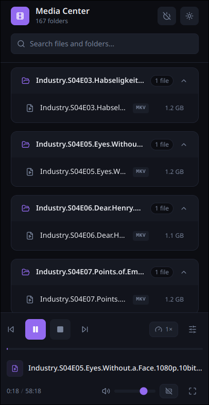

# Media Center



A local media browser and playback controller built on a React + Hono full-stack Vite setup. The app scans a configured directory on the host machine, lists video files grouped by folder, and controls a running `mpv` process via its IPC socket — all from a browser UI that works on both desktop and mobile.

---

## Stack

| Layer | Technology |
|---|---|
| Frontend | React 18, TypeScript, Tailwind CSS v4 |
| Components | shadcn/ui (Radix UI primitives) |
| State / data fetching | TanStack Query v5, Zustand |
| API server | Hono (mounted inside Vite dev server) |
| Runtime / package manager | Bun |
| Media player | mpv (controlled via Unix IPC socket) |

---

## Environment

A `.env` file is required in the project root. It is loaded by `vite.config.ts` using `loadEnv` and merged into `process.env` so the Hono API can read it.

```
MEDIA_PATH=/absolute/path/to/your/media/root
```

The `.env` file is gitignored. See `.env.example` for the required variables.

---

## Dev Commands

```bash
bun run dev       # Start dev server (frontend + API on the same origin)
bun run build     # Production build
bun run lint      # ESLint
bun run preview   # Preview the production build
```

The dev server runs on `http://localhost:5173`. API routes are available at `http://localhost:5173/api/*`.

---

## Project Structure

```
media-center/
├── api/                        # Hono API server (Node.js, runs inside Vite)
│   ├── app.ts                  # All API routes and mpv IPC logic
│   ├── dev.ts                  # Vite dev-server entry point (just re-exports app)
│   └── tsconfig.json           # TypeScript config scoped to the API
│
├── src/                        # React frontend
│   ├── main.tsx                # App entry — mounts QueryClientProvider + ThemeProvider
│   ├── App.tsx                 # Root component — media browser UI, search, play dialog
│   ├── App.css                 # Minimal root height rule
│   ├── index.css               # Tailwind import, CSS variable theme tokens (light + dark)
│   │
│   ├── components/
│   │   ├── providers/
│   │   │   └── theme-provider.tsx      # Applies "light"/"dark" class to <html>, reads useThemeStore
│   │   └── ui/
│   │       ├── player-bar.tsx          # Persistent bottom player bar (see below)
│   │       ├── button.tsx              # shadcn Button
│   │       ├── dialog.tsx              # shadcn Dialog (used for play confirmation)
│   │       ├── dropdown-menu.tsx       # shadcn DropdownMenu (used for subtitle selector)
│   │       └── context-menu.tsx        # shadcn ContextMenu
│   │
│   └── lib/
│       ├── utils.ts                    # cn() helper (clsx + tailwind-merge)
│       └── hooks/
│           ├── api/
│           │   ├── use-directory-content.ts  # useMediaFiles, useDirectoryContent hooks + types
│           │   └── use-player.ts             # All player hooks + types (see below)
│           └── store/
│               └── use-theme-store.ts        # Zustand store — persists "light" | "dark" theme
│
├── packages/                   # Shared code between frontend and API (aliased as @shared)
├── public/                     # Static assets
├── vite.config.ts              # Vite config — loads .env into process.env, mounts Hono
├── index.html                  # HTML entry point
├── .env                        # Local env vars (gitignored)
├── .env.example                # Template showing required variables
└── package.json
```

---

## API Routes

All routes are prefixed with `/api` and defined in `api/app.ts`.

### Media browsing

| Method | Route | Description |
|---|---|---|
| `GET` | `/api/browse?path=<dir>` | Lists all entries in a directory with type and size |
| `GET` | `/api/media?path=<dir>` | Lists video files grouped by subdirectory. Defaults to `MEDIA_PATH`. Filters by `VIDEO_EXTENSIONS` |

### Player control

All player routes communicate with mpv via a Unix IPC socket at `/tmp/mpv-media-center.sock`. The status route checks for the socket file directly, so it reconnects to a running mpv even after the API server restarts.

| Method | Route | Body | Description |
|---|---|---|---|
| `GET` | `/api/player/status` | — | Returns full player state. `{ playing, paused, title, position, duration, volume, fullscreen, subtitles, subtitleOffset }` |
| `POST` | `/api/player/play` | `{ path: string }` | Kills any running mpv, spawns a new instance with the IPC socket flag |
| `POST` | `/api/player/pause` | — | Sets `pause = true` via IPC |
| `POST` | `/api/player/resume` | — | Sets `pause = false` via IPC |
| `POST` | `/api/player/stop` | — | Kills mpv process or sends `quit` via IPC if process is unowned |
| `POST` | `/api/player/seek` | `{ position: number }` | Seeks to absolute position in seconds |
| `POST` | `/api/player/skip` | `{ seconds: number }` | Seeks relative to current position (use negative to go back) |
| `POST` | `/api/player/volume` | `{ volume: number }` | Sets volume (0–130, matching mpv's range) |
| `POST` | `/api/player/fullscreen` | `{ fullscreen: boolean }` | Sets fullscreen property on mpv window |
| `POST` | `/api/player/subtitle` | `{ id: number \| "no" }` | Sets active subtitle track by ID, or `"no"` to disable |
| `POST` | `/api/player/subtitle-offset` | `{ offset: number }` | Sets the subtitle delay in seconds (`sub-delay` in mpv). Negative values make subtitles appear earlier, positive values later |

---

## Frontend Hooks

### `src/lib/hooks/api/use-directory-content.ts`

| Export | Description |
|---|---|
| `useMediaFiles(path)` | Fetches `/api/media`. Returns `MediaContent` — groups of folders with their video files |
| `useDirectoryContent(path)` | Fetches `/api/browse`. Returns raw directory entries with type and size |
| `MediaFile` | `{ name, path, size }` |
| `MediaGroup` | `{ name, path, files: MediaFile[] }` |
| `MediaContent` | `{ path, groups: MediaGroup[] }` |

### `src/lib/hooks/api/use-player.ts`

| Export | Description |
|---|---|
| `usePlayerStatus()` | Polls `/api/player/status` — every 1s while playing, every 3s while idle |
| `usePlayFile()` | Mutation — POSTs to `/api/player/play` with a file path |
| `usePausePlayer()` | Mutation — optimistically sets `paused: true` |
| `useResumePlayer()` | Mutation — optimistically sets `paused: false` |
| `useStopPlayer()` | Mutation — optimistically sets `playing: false` |
| `useSeekPlayer()` | Mutation — optimistically updates `position` (absolute seek) |
| `useSkipPlayer()` | Mutation — optimistically nudges `position` by ±N seconds (relative seek) |
| `useSetVolume()` | Mutation — optimistically updates `volume` |
| `useSetFullscreen()` | Mutation — optimistically updates `fullscreen` |
| `useSetSubtitle()` | Mutation — optimistically updates `selected` on the subtitles array |
| `useAdjustSubtitleOffset()` | Mutation — optimistically updates `subtitleOffset`; POSTs absolute offset in seconds to `/api/player/subtitle-offset` |
| `PlayerStatus` | Full status shape returned by the status endpoint |
| `SubtitleTrack` | `{ id, title, lang, selected }` |

### `src/lib/hooks/store/use-theme-store.ts`

Zustand store persisted to `localStorage` under the key `theme-storage`.

| Field / method | Description |
|---|---|
| `theme` | `"light" \| "dark"` |
| `setTheme(theme)` | Sets theme explicitly |
| `toggleTheme()` | Flips between light and dark |

---

## Key Components

### `src/App.tsx`

The root component. Responsibilities:
- Renders the header (logo, folder count, theme toggle)
- Search input that filters groups and files client-side
- Renders `DirectoryGroup` cards, each collapsible, containing `MediaFileRow` items
- Clicking a file opens `PlayDialog` (confirmation before sending play request)
- Renders `PlayerBar` at the bottom when `playerStatus.playing === true`

### `src/components/ui/player-bar.tsx`

The persistent playback control bar. Rendered in three rows:
1. **Playback controls** — skip back 10s, play/pause, skip forward 10s, stop (centred)
2. **Seek scrubber** — draggable/tappable progress bar (pointer capture for mobile drag)
3. **Info + secondary controls** — file icon, title, timestamp / volume slider+mute / subtitle dropdown / fullscreen toggle

The **More Controls** dialog (opened via the sliders icon in the playback row) contains additional controls:
- **Subtitle Offset** — `−` / `+` buttons adjust the subtitle delay by 0.1 s per tap; a **Reset** button returns it to 0. The current offset is displayed and highlighted in primary colour when non-zero.
- **Display** — sets the connected display to 1920×1080 via `xrandr`.

### `src/components/providers/theme-provider.tsx`

Reads `useThemeStore` and applies the `"light"` or `"dark"` class to `document.documentElement`. Also checks `prefers-color-scheme` on first load if no saved preference exists.

---

## Styling Conventions

- **All colours use CSS variable-based Tailwind classes** — `bg-background`, `text-foreground`, `bg-muted`, `text-muted-foreground`, `bg-primary`, `text-primary-foreground`, `bg-card`, `border-border`, `bg-accent`, `text-destructive`, etc.
- **Never use hardcoded colour classes** like `bg-zinc-900` or `text-gray-500`. This ensures light/dark theme switching works correctly throughout.
- CSS variables for both themes are defined in `src/index.css`.

---

## Path Aliases

| Alias | Resolves to |
|---|---|
| `@` | `./src` |
| `@shared` | `./packages` |
